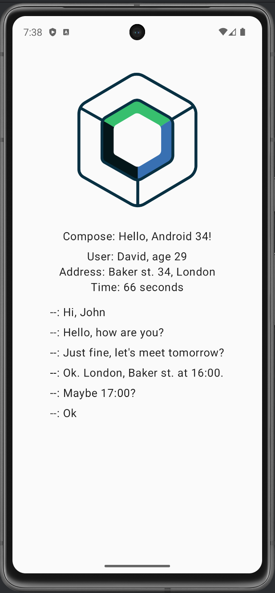

# KMP project with SKIE

This is a Kotlin Multiplatform project targeting Android and iOS.

* `/shared` is common Kotlin code that will be shared between all targets in the project.
  The most important subfolder is `commonMain`.
  If preferred, you can add code to the platform-specific folders here too.
  SKIE plugin used here to transform Kotlin code to use it with Swift.

* `/composeApp` contains Android application. It's built with Jetpack compose and relies on data from `/shared` module.
  

* `/iosApp` contains iOS application. It's built with SwiftUI and relies on data from `/shared` module.

Learn more about [Kotlin Multiplatform](https://www.jetbrains.com/help/kotlin-multiplatform-dev/get-started.html)

## Mobile app screens

| iOS app   | Android app |
|------------|-------------|
|  |  |

To create the project Kotlin Multiplatform project wizard was used.
https://kotlinlang.org/docs/whatsnew1920.html#new-project-wizard
